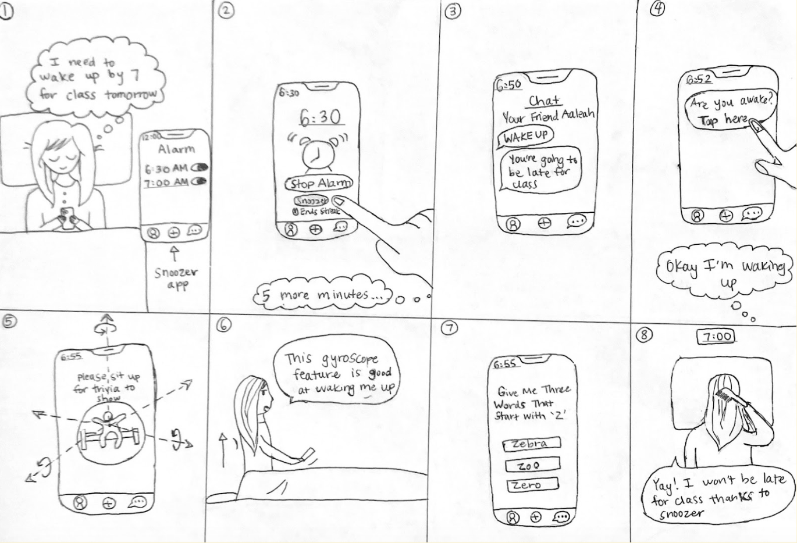
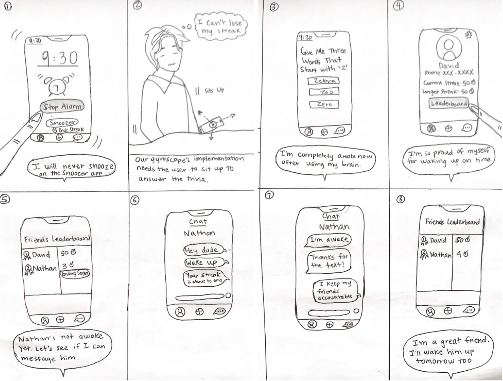
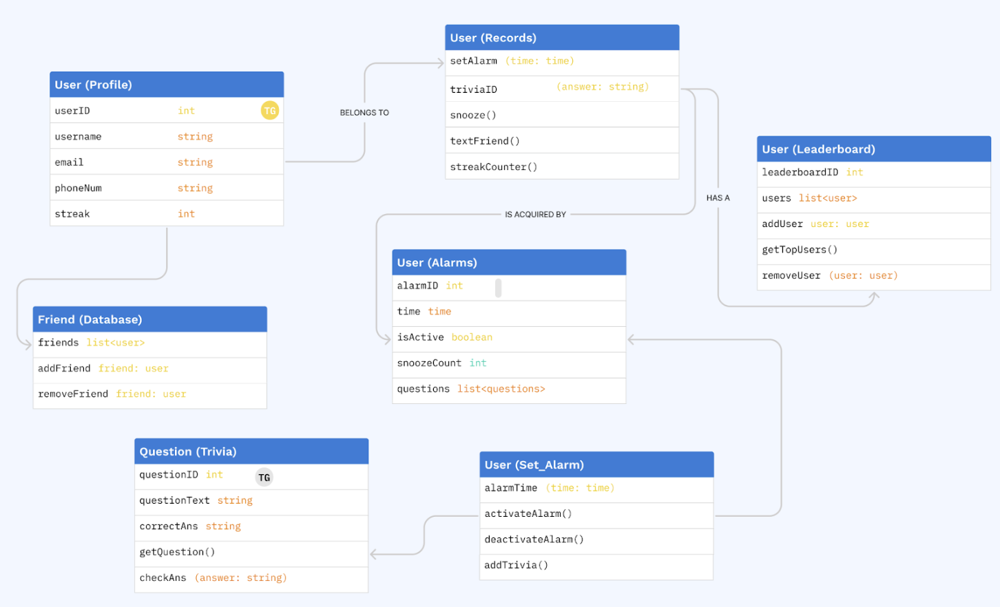

# Code and Design Specification
## Functional Requirements

*Primary:*

1. Users will be able to wake up on time
2. Users will be able to feel haptic vibrations
3. Users will be able to interact with gyroscope
4. Users will be able to message friends
5. Users will be able to answer questions to turn off alarm

*Secondary:*
1. Users will be able to keep a streak of waking up on time
2. Users will be able to call their friends to wake them up

## Technical Requirements
*Primary:*
1. Application will be able to detect via backend if user has stood up
2. Application will be able to generate questions via backend
3. Application will be able to connect with other users through backend
4. Application will have an API to include messaging functionality

*Secondary:*
1. Application will store data to accumulate the streaks on the backend
2. Application should support voice calls between users via voice calling API
3. Usability Requirements
	
*Primary:*
1. Flow of Screens is intuitive
2. Small snooze button will be placed strategically with bright orange color
3. Application will be able to stop the alarm once they’ve answered the questions.

*Secondary:*
1. Application will support mobile users
2. Application will support customizable alarm sounds

## Storyboard
*Storyboard 1:* An undergraduate student needs to wake up by 7am for class, but she keeps snoozing the alarm. 

*Storyboard 2:* A student wakes up on time and keeps his friend accountable by waking him up. 

## Architectural design
The figure depicts a UML class diagram representing key components of Snoozer. It consists of four primary classes: User, Alarm, Question, and Leaderboard. The User class encapsulates user information such as user ID, username, password, email, phone number, and streak. It also includes methods for setting alarms, answering questions, snoozing, and pinging friends. The Alarm class contains methods for setting alarm time, activation, deactivation, adding questions, and managing friends. The Question class represents trivia questions and provides methods for retrieving question text and checking answers. Lastly, the Leaderboard class tracks user streaks and includes methods for adding/removing users and retrieving top users. Together, these classes form the core functionalities of Snoozer, enabling users to set alarms, answer questions, track streaks, and interact socially with friends.

## System Description: How it Connects All Together

Our architectural design allows Snoozer to track a user’s profile and keep track of their streaks through the Profile table. This, along with the leaderboard, allows the app to provide users an incentive to not snooze their alarm and instead enter the trivia/game from stopping their alarm. The Trivia table stores the questions for this use. For social accountability, Snoozer has a chat system that will likely be managed through an API using textFriend(). Additionally, the entire network of friends in this app will be managed through a Friends table to allow for these communication channels in the first place. Finally, alarms will be added similar to iOS alarms in order to keep the flow of the app intuitive, with all alarms and their specifications stored in a table. 

## Code Spec:

*Primary*
1. Alarm Setting and Wake Up
	- AlarmManager: A class to manage alarm creation, modification, and deletion.
	- AlarmScheduler: A class responsible for scheduling alarms using UNNotificationRequest.
	- WakeUpViewController: A view controller displayed when an alarm goes off.

2. Haptic Feedback
	- HapticManager: A class to handle haptic feedback using UIImpactFeedbackGenerator.

3. Gyroscope Interaction
	- GyroscopeManager: A class to manage gyroscope data using CoreMotion.

4. Social Accountability Methods
	- AccountabilityManager: A class to manage chat accountability

5. Questions to Turn Off Alarm
	- QuestionManager: A class to generate and manage questions or puzzles.
	- QuestionViewController: A view controller that presents questions to the user and validates their answers.

*Secondary*

6. Streak Keeping
	- StreakManager: A class to track and update wake-up streaks.
	- StreakViewController: A view controller to display the user's current streak.
