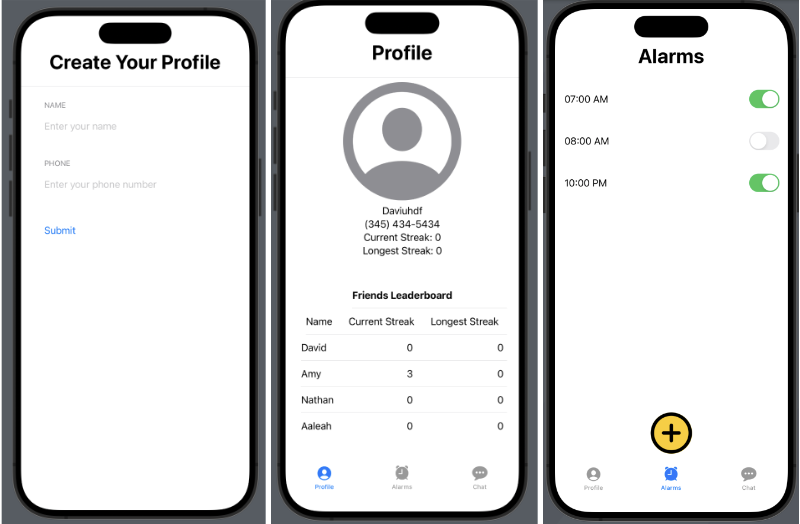
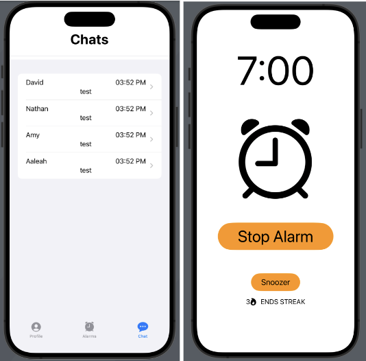
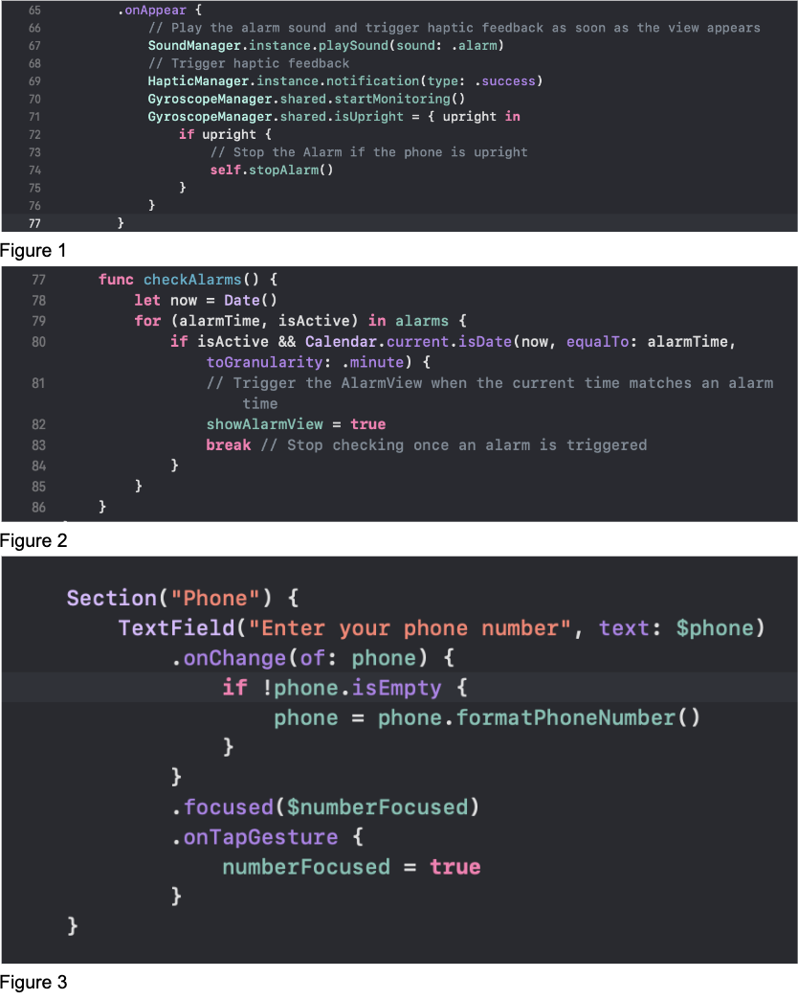
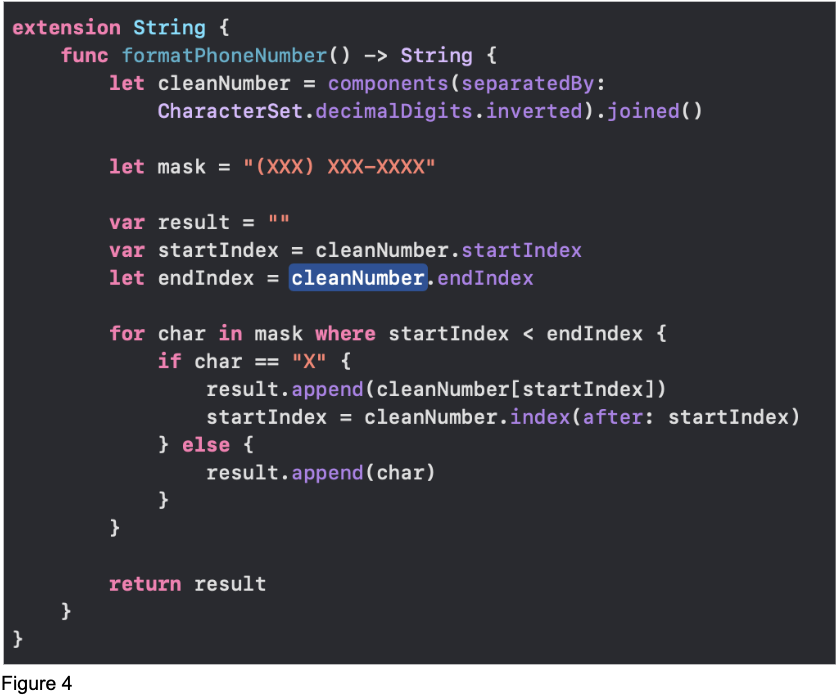

# Digital Prototype
## Our Problem Space

Imagine waking up feeling refreshed and ready to finally eat breakfast and find a routine. Yet, for many of us, oversleeping can become an all too common hurdle, hindering productivity and leaving us feeling groggy and unprepared. That's where our project steps in. We understand that sleep is a precious commodity, and how we wake up sets the tone for the entire day. Our team is on a mission to revolutionize mornings by introducing a solution that not only rouses you from slumber but propels you into action. D&NA had many meetings to answer this big question: How can we revolutionize the way people approach their mornings, starting from the very first moment they wake up?

## Our Solution: Snoozer

Introducing Snoozer, our innovative alarm system designed to redefine your morning routine. Unlike traditional alarms, Snoozer isn't just a wake-up call; 
it's a catalyst for an engaging morning routine. It encourages us to answer a trivia question before the alarm stops ringing. Additionally, by incorporating a social feature, 
users can interact with friends in the morning, fostering a sense of community and accountability – by texting your friends to wake up or hold you accountable for snoozing.

Targeting students and postgraduates, we recognize their dynamic schedules. Our solution isn't just about combating oversleeping; it's about aligning with modern life, empowering individuals to start their day with purpose.

## Implementation

To build Snoozer, we're using XCODE’s Swift Language and SQLite for databases to develop a mobile app. Snoozer tracks user profiles and streaks through a Profile table, encouraging consistency in waking up. It includes trivia questions stored in a Trivia table and a chat system managed through an API. Specialized classes like AlarmManager handle alarm settings, while QuestionManager generates trivia questions. 
Our goal is to create an engaging app that helps users wake up refreshed and motivated each morning.

## Accessing Our Prototype

Currently, Snoozer operates on local devices via Xcode. You can access our codebase HERE [NEEDS LINK], and utilize this LINK [NEEDS LINK] to clone the project and experience our live app through your own screen!

## Documentation of Prototype

Description: 

- Create Your Profile: If you don’t have a profile yet, once you launch the app you’ll get to the screen where you need a name and optionally a phone number.

- Profile View: Create your own profile with your name and picture, and choose what you want others to see. It's like your Snoozer identity.

- Global Alarm: Set alarms that work everywhere, no matter the time zone, with different sounds to help you wake up on time, no matter where you are.

- Chatroom: Talk with others in real-time chat rooms to share your goals and help each other stay on track. It's like having friends cheering you on to wake up and get going.

- Alarm View: Display this AlarmView when the alarm rings. Have options to Stop the alarm or Snooze it. Stopping the alarm requires users to answer some trivia questions while snoozing it sets your current streak back to 0.

## Technical Issues
During the development of our app, we encountered various technical hurdles. Some challenges were:

1. Syncing sound and triggering haptic feedback in AlarmView to when the alarm actually rings.

2. Validating phone numbers and displaying them correctly on the profile tab.

To address the problems we’ve encountered, here are our solutions and rationale tailored to each specific challenge:

1. We leveraged Swift’s “.onAppear” command to immediately display the AlarmView when the current time matches set time (refer to Figure 1).
We made sure to test the SoundManager and HapticManager using a button via our usability test before syncing that up with our Alarm.
In this way, we can ensure that our Alarm functionality works. Additionally, we wanted to make sure that the Alarm is functioning correctly.
We made sure that the alarm set is equal to that of the current time on your phone (refer to Figure 2).

2. When implementing the AddProfileView on startup, our first solution was to store phone numbers as integers of 10 digits, but this has problems with displaying on the ProfileView, and if a number started with a zero, then it wouldn’t work. So, we decided to make it a string, but then we needed a way to validate it so that it looked like a phone number. We found a good example online of how this should be done in swift and we were able to adapt it to our own use (refer to Figure 3 & 4)

