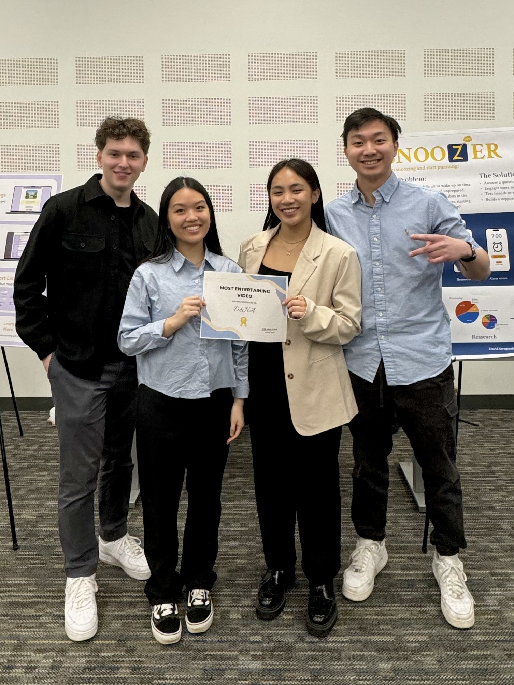
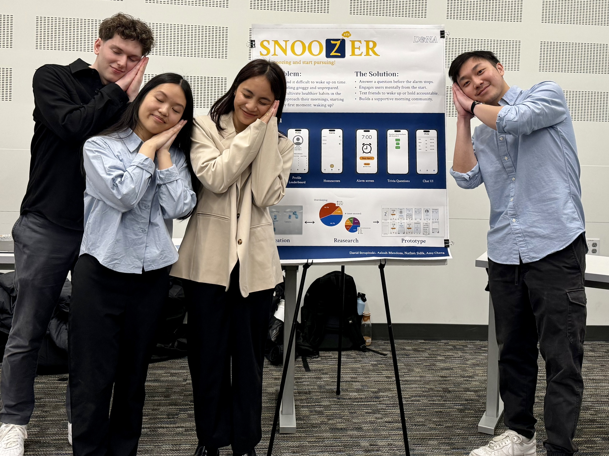

Welcome to Snoozer, made by D&NA! We’ve created an iOS app to help students revolutionize their morning routines and cultivate healthier habits. The key features of the app are: 

1. Chat Feature to emphasize social accountability in waking up friends
  
2. Trivia Questions to wake your brain up Leaderboards and Streaks to compare on time wake up times

### Check out our demo video, which won the "Most Entertaining Video" Award

### Interested? Try it yourself [here!](https://github.com/UWSocialComputing/D-NA-code)

# Team D&NA

## About Us

We are Team D&NA, a group of passionate individuals dedicated to cultivate healthier habits in the way people approach their mornings.

From left to right:

#### [David Strupinski](https://www.linkedin.com/in/david-strupinski/)
- **Role:** Full Stack Developer

#### [Amy Cheng](https://www.linkedin.com/in/amy-chengg/)
- **Role:** Frontend Developer

#### [Aaleah Mendoza](https://www.linkedin.com/in/aaleah-mendoza-a3093117a/)
- **Role:** Assistant PM & Creative Director

#### [Nathan Sidik](https://www.linkedin.com/in/nathan-sidik/)
- **Role:** PM & Full Stack Developer
